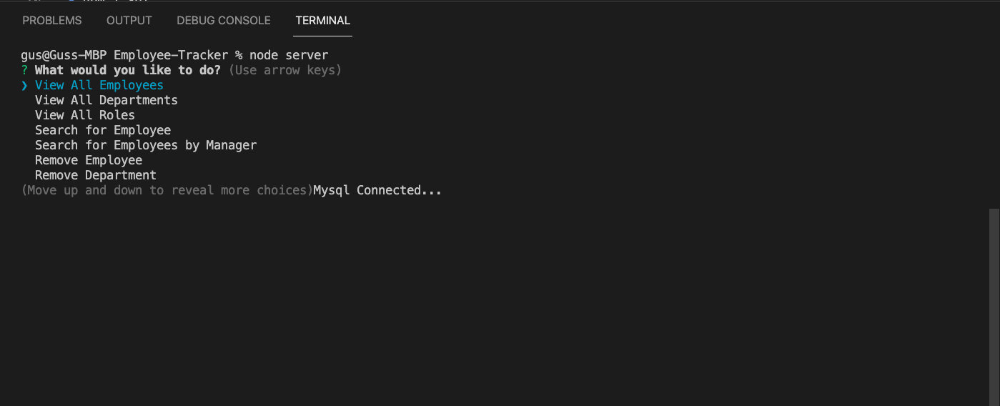
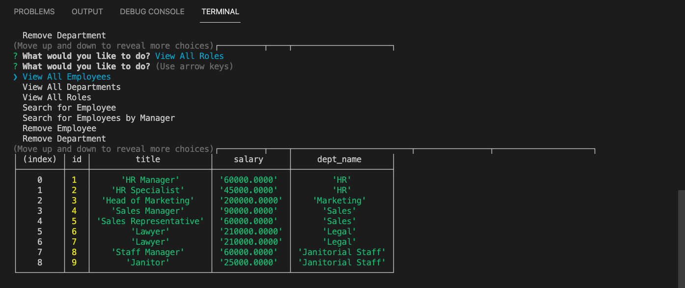
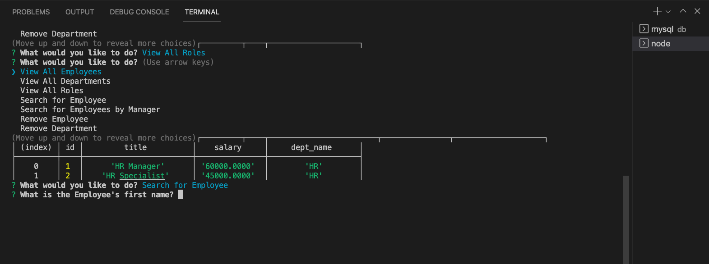
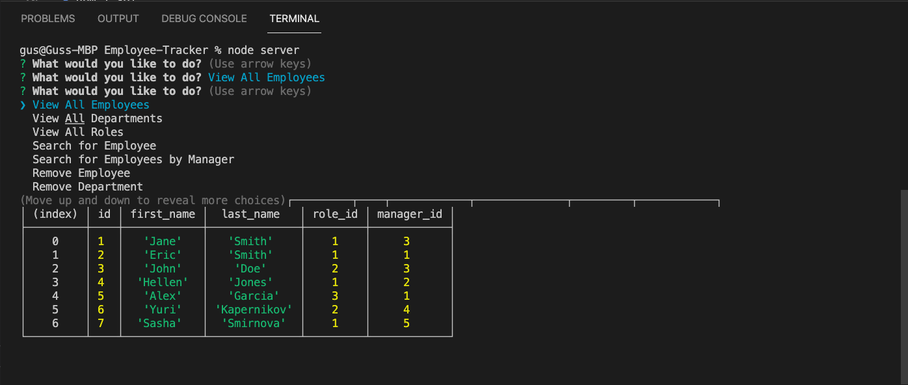
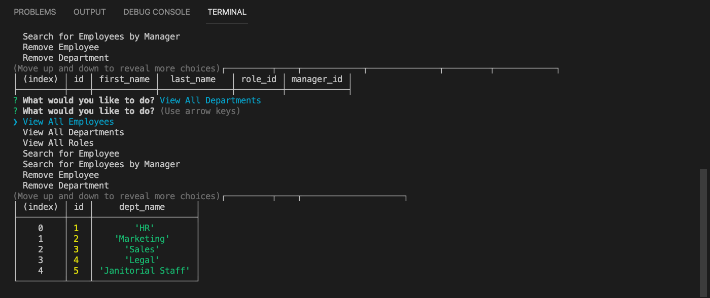

# Employee-Tracker

* Description
* Installations
* Licence
* Contributing
* Contributing
* User Story
* Demo Video

* Questions

# Description
Content Management System, this app can add or remove employees, departments, and roles etc. The app used MySQL to store all the data.
# Installations
* express
* npm init -y
* npm i inquirer
* npm i mysql
* npm i sql
# Contributing
A work in progress. And the possibilities are endless.
Please feel free to submit any code updates for review and acceptance.

* 

# User-Story
As a business owner I want to be able to view and manage the departments, roles, and employees in my company So that I can organize and plan my business
 # Licence

 # Screenshots:
 * 
 * 
 * 
 * 
 * 

 # Project Demo Video

 # Questions
 please feel free to ask me any questions.

 * augustine2903a@gmail.com